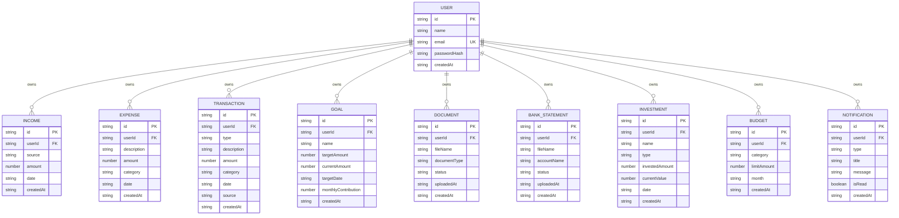

# NexWealth — Shared Data Contract & Database Specification

> **Version:** 1.0.0  
> **Status:** Active / Single Source of Truth  
> **Target Currency:** Indian Rupee (`INR` / `₹`)  
> **Naming Convention:** `camelCase`  

---

## 1. Overview & Purpose

This document serves as the **single source of truth** for all backend, database, and API models across the NexWealth platform. All team members must adhere to the data schemas, field naming conventions, relationship constraints, and calculation logic defined herein.

---

## 2. Global Rules & Conventions

1. **User Ownership:** Every user-owned entity MUST include a `userId` referencing the primary `User.id`.
2. **Naming Conventions:** All entity field names must strictly follow `camelCase`. Table/Collection names should match entity singular or plural conventions consistently.
3. **Primary Keys / Unique IDs:** Every entity has a unique `id` (e.g., UUID v4 or auto-generated unique string).
4. **Timestamps:** 
   - Every entity must contain `createdAt` (ISO 8601 UTC timestamp string, e.g., `2026-10-06T08:55:00.000Z`).
   - File/statement upload entities include `uploadedAt` alongside `createdAt`.
5. **Currency & Financial Handling:**
   - **Currency is strictly INR (₹)**.
   - **Never use USD or `$` symbols anywhere** in the database, API payloads, or user interfaces.
   - All monetary values are stored as raw numeric values (`number` / `float` / `decimal`), without currency symbols or commas in the DB.
   - UI display formatting MUST follow the Indian Numbering System (e.g., `₹1,00,000`, `₹15,50,750.50`, formatted with `en-IN` locale).
6. **Date Format:** Dates are stored as ISO 8601 strings (`YYYY-MM-DD` or full ISO timestamp `YYYY-MM-DDTHH:mm:ss.sssZ`).

---

## 3. Team Ownership Matrix

| Team Member | Assigned Entities | Domain Responsibilities |
| :--- | :--- | :--- |
| **Person 1** | `User`, `Income`, `Expense`, `Transaction` | Authentication, Core Cashflow, Income & Expense Management, Ledger/Transactions |
| **Person 2** | `Goal`, `Document`, `BankStatement` | Savings Goals, Document Vault, Statement Uploads & Processing |
| **Person 3** | `Investment`, `Budget`, `Notification` | Portfolio & Investments, Monthly Budgets, Notification Engine |

---

## 4. Entity Definitions

### 4.1 Person 1 Entities

#### 1. User
Represents registered users in the platform.

| Field | Type | Required | Description | Example |
| :--- | :--- | :--- | :--- | :--- |
| `id` | String | Yes | Unique user identifier (UUID) | `"usr_9f8b2c1a"` |
| `name` | String | Yes | Full name of user | `"Aarav Sharma"` |
| `email` | String | Yes | Unique email address | `"aarav.sharma@example.com"` |
| `passwordHash` | String | Yes | Hashed password string | `"$2b$12$e8..."` |
| `createdAt` | String | Yes | ISO 8601 timestamp | `"2026-10-06T08:55:00.000Z"` |

---

#### 2. Income
Represents recurring or one-off income streams.

| Field | Type | Required | Description | Example |
| :--- | :--- | :--- | :--- | :--- |
| `id` | String | Yes | Unique income entry ID | `"inc_3a7d1e90"` |
| `userId` | String | Yes | Reference to `User.id` | `"usr_9f8b2c1a"` |
| `source` | String | Yes | Source of income (e.g., Salary, Freelance, Dividend) | `"Monthly Salary"` |
| `amount` | Number | Yes | Amount in INR (positive number) | `125000` |
| `date` | String | Yes | Date income received (`YYYY-MM-DD`) | `"2026-10-01"` |
| `createdAt` | String | Yes | ISO 8601 timestamp | `"2026-10-06T08:55:00.000Z"` |

---

#### 3. Expense
Represents categorized spending records.

| Field | Type | Required | Description | Example |
| :--- | :--- | :--- | :--- | :--- |
| `id` | String | Yes | Unique expense entry ID | `"exp_8c2b4e61"` |
| `userId` | String | Yes | Reference to `User.id` | `"usr_9f8b2c1a"` |
| `description` | String | Yes | Description of the expense | `"Grocery Store Restock"` |
| `amount` | Number | Yes | Amount in INR (positive number) | `4500` |
| `category` | String (Enum) | Yes | One of the standard expense categories | `"Food"` |
| `date` | String | Yes | Date of expense (`YYYY-MM-DD`) | `"2026-10-03"` |
| `createdAt` | String | Yes | ISO 8601 timestamp | `"2026-10-06T08:55:00.000Z"` |

**Allowed Expense Categories (Strict Enum):**
- `Food`
- `Shopping`
- `Transport`
- `Bills`
- `Entertainment`
- `Education`
- `Medical`
- `Travel`
- `Other`

---

#### 4. Transaction
Unified ledger records tracking money flowing in and out.

| Field | Type | Required | Description | Example |
| :--- | :--- | :--- | :--- | :--- |
| `id` | String | Yes | Unique transaction ID | `"txn_5d4e3f2a"` |
| `userId` | String | Yes | Reference to `User.id` | `"usr_9f8b2c1a"` |
| `type` | String (Enum) | Yes | `"income"` or `"expense"` | `"expense"` |
| `description` | String | Yes | Transaction details/narration | `"Electricity Bill Payment"` |
| `amount` | Number | Yes | Amount in INR | `2800` |
| `category` | String | Yes | Category tag (e.g., Expense category or Income source) | `"Bills"` |
| `date` | String | Yes | Transaction date (`YYYY-MM-DD`) | `"2026-10-05"` |
| `source` | String | Yes | Payment mode/source (e.g., HDFC Bank, UPI, Cash) | `"HDFC Bank UPI"` |
| `createdAt` | String | Yes | ISO 8601 timestamp | `"2026-10-06T08:55:00.000Z"` |

---

### 4.2 Person 2 Entities

#### 5. Goal
Represents targeted financial savings goals.

| Field | Type | Required | Description | Example |
| :--- | :--- | :--- | :--- | :--- |
| `id` | String | Yes | Unique goal ID | `"gol_1b2c3d4e"` |
| `userId` | String | Yes | Reference to `User.id` | `"usr_9f8b2c1a"` |
| `name` | String | Yes | Name/Title of the goal | `"Emergency Fund"` |
| `targetAmount` | Number | Yes | Target amount in INR | `500000` |
| `currentAmount` | Number | Yes | Accumulated amount in INR | `175000` |
| `targetDate` | String | Yes | Target completion date (`YYYY-MM-DD`) | `"2027-03-31"` |
| `monthlyContribution` | Number | Yes | Planned monthly contribution in INR | `25000` |
| `createdAt` | String | Yes | ISO 8601 timestamp | `"2026-10-06T08:55:00.000Z"` |

---

#### 6. Document
Represents uploaded financial records and receipts.

| Field | Type | Required | Description | Example |
| :--- | :--- | :--- | :--- | :--- |
| `id` | String | Yes | Unique document ID | `"doc_7a8b9c0d"` |
| `userId` | String | Yes | Reference to `User.id` | `"usr_9f8b2c1a"` |
| `fileName` | String | Yes | Name of uploaded file | `"tax_return_ay26_27.pdf"` |
| `documentType` | String | Yes | Type/Category of document (e.g., Tax, Insurance, Invoice) | `"Tax Return"` |
| `status` | String | Yes | Processing status (e.g., `uploaded`, `verified`, `pending`) | `"uploaded"` |
| `uploadedAt` | String | Yes | ISO 8601 timestamp of upload | `"2026-10-06T08:55:00.000Z"` |
| `createdAt` | String | Yes | ISO 8601 timestamp | `"2026-10-06T08:55:00.000Z"` |

---

#### 7. BankStatement
Represents uploaded bank statements for automated parsing and tracking.

| Field | Type | Required | Description | Example |
| :--- | :--- | :--- | :--- | :--- |
| `id` | String | Yes | Unique statement ID | `"bst_9e8d7c6b"` |
| `userId` | String | Yes | Reference to `User.id` | `"usr_9f8b2c1a"` |
| `fileName` | String | Yes | Original file name | `"hdfc_sep_2026_statement.pdf"` |
| `accountName` | String | Yes | Account identifier / Bank name | `"HDFC Salary Account"` |
| `status` | String | Yes | Status (e.g., `uploaded`, `processing`, `parsed`, `failed`) | `"parsed"` |
| `uploadedAt` | String | Yes | ISO 8601 timestamp of upload | `"2026-10-06T08:55:00.000Z"` |
| `createdAt` | String | Yes | ISO 8601 timestamp | `"2026-10-06T08:55:00.000Z"` |

---

### 4.3 Person 3 Entities

#### 8. Investment
Represents portfolio holdings (Mutual Funds, Stocks, Fixed Deposits, Gold, etc.).

| Field | Type | Required | Description | Example |
| :--- | :--- | :--- | :--- | :--- |
| `id` | String | Yes | Unique investment ID | `"inv_4f3e2d1c"` |
| `userId` | String | Yes | Reference to `User.id` | `"usr_9f8b2c1a"` |
| `name` | String | Yes | Name/Asset title | `"Nifty 50 Index Fund"` |
| `type` | String | Yes | Asset class (e.g., Mutual Fund, Stock, FD, Gold, PPF) | `"Mutual Fund"` |
| `investedAmount`| Number | Yes | Total principal invested in INR | `200000` |
| `currentValue` | Number | Yes | Current valuation in INR | `248500` |
| `date` | String | Yes | Investment/Purchase date (`YYYY-MM-DD`) | `"2025-11-15"` |
| `createdAt` | String | Yes | ISO 8601 timestamp | `"2026-10-06T08:55:00.000Z"` |

---

#### 9. Budget
Represents monthly budget caps per expense category.

| Field | Type | Required | Description | Example |
| :--- | :--- | :--- | :--- | :--- |
| `id` | String | Yes | Unique budget ID | `"bdg_2c4e6a80"` |
| `userId` | String | Yes | Reference to `User.id` | `"usr_9f8b2c1a"` |
| `category` | String (Enum) | Yes | Target expense category (matches Expense categories) | `"Food"` |
| `limitAmount` | Number | Yes | Budget limit in INR | `15000` |
| `month` | String | Yes | Target month string format (`YYYY-MM`) | `"2026-10"` |
| `createdAt` | String | Yes | ISO 8601 timestamp | `"2026-10-06T08:55:00.000Z"` |

---

#### 10. Notification
Represents user notifications and alerts.

| Field | Type | Required | Description | Example |
| :--- | :--- | :--- | :--- | :--- |
| `id` | String | Yes | Unique notification ID | `"ntf_6b5a4c3d"` |
| `userId` | String | Yes | Reference to `User.id` | `"usr_9f8b2c1a"` |
| `type` | String | Yes | Category/type (e.g., `budget_alert`, `goal_reached`, `system`) | `"budget_alert"` |
| `title` | String | Yes | Notification heading | `"Budget 80% Reached"` |
| `message` | String | Yes | Notification message text | `"You have spent ₹12,000 of your ₹15,000 Food budget."` |
| `isRead` | Boolean | Yes | Read flag (`true` / `false`) | `false` |
| `createdAt` | String | Yes | ISO 8601 timestamp | `"2026-10-06T08:55:00.000Z"` |

---

## 5. Entity Relationships & Foreign Keys



---

## 6. Core Calculations & Business Logic

All calculation services across backend endpoints and frontend dashboards must apply these standardized formulas:

### 6.1 Total Income
$$\text{Total Income} = \sum (\text{Income.amount})$$
*Calculated across all income entries for a given user within the target period (e.g. month/year).*

### 6.2 Total Expenses
$$\text{Total Expenses} = \sum (\text{Expense.amount})$$
*Calculated across all expense entries for a given user within the target period.*

### 6.3 Available Savings
$$\text{Available Savings} = \text{Total Income} - \text{Total Expenses}$$

### 6.4 Savings Rate
$$\text{Savings Rate (\%)} = \left( \frac{\text{Available Savings}}{\text{Total Income}} \right) \times 100$$
*(If $\text{Total Income} = 0$, Savings Rate defaults to $0\%$)*

### 6.5 Goal Progress
$$\text{Goal Progress (\%)} = \left( \frac{\text{currentAmount}}{\text{targetAmount}} \right) \times 100$$
*(Capped at $100\%$ for progress bars unless tracking surplus)*

---

## 7. Currency Formatting Standards

- **Internal representation:** Raw numbers only (e.g., `100000`, `1550750.5`).
- **UI Format:** Indian Rupee formatting with `₹` symbol and `en-IN` numbering grouping (Lakhs & Crores).

```javascript
// Standard JavaScript Currency Formatter
export const formatINR = (amount) => {
  return new Intl.NumberFormat('en-IN', {
    style: 'currency',
    currency: 'INR',
    maximumFractionDigits: 2,
  }).format(amount);
};

// Examples:
// formatINR(100000)   -> "₹1,00,000.00" or "₹1,00,000"
// formatINR(1550750)  -> "₹15,50,750.00"
```

---

## 8. Sample JSON Payloads

```json
{
  "user": {
    "id": "usr_9f8b2c1a",
    "name": "Aarav Sharma",
    "email": "aarav.sharma@example.com",
    "passwordHash": "$2b$12$e8YQjG...",
    "createdAt": "2026-10-06T08:55:00.000Z"
  },
  "income": {
    "id": "inc_3a7d1e90",
    "userId": "usr_9f8b2c1a",
    "source": "Monthly Salary",
    "amount": 125000,
    "date": "2026-10-01",
    "createdAt": "2026-10-06T08:55:00.000Z"
  },
  "expense": {
    "id": "exp_8c2b4e61",
    "userId": "usr_9f8b2c1a",
    "description": "Supermarket Grocery",
    "amount": 4500,
    "category": "Food",
    "date": "2026-10-03",
    "createdAt": "2026-10-06T08:55:00.000Z"
  },
  "transaction": {
    "id": "txn_5d4e3f2a",
    "userId": "usr_9f8b2c1a",
    "type": "expense",
    "description": "Electricity Bill Payment",
    "amount": 2800,
    "category": "Bills",
    "date": "2026-10-05",
    "source": "HDFC Bank UPI",
    "createdAt": "2026-10-06T08:55:00.000Z"
  },
  "goal": {
    "id": "gol_1b2c3d4e",
    "userId": "usr_9f8b2c1a",
    "name": "Emergency Fund",
    "targetAmount": 500000,
    "currentAmount": 175000,
    "targetDate": "2027-03-31",
    "monthlyContribution": 25000,
    "createdAt": "2026-10-06T08:55:00.000Z"
  },
  "document": {
    "id": "doc_7a8b9c0d",
    "userId": "usr_9f8b2c1a",
    "fileName": "tax_return_ay26_27.pdf",
    "documentType": "Tax Return",
    "status": "uploaded",
    "uploadedAt": "2026-10-06T08:55:00.000Z",
    "createdAt": "2026-10-06T08:55:00.000Z"
  },
  "bankStatement": {
    "id": "bst_9e8d7c6b",
    "userId": "usr_9f8b2c1a",
    "fileName": "hdfc_sep_2026_statement.pdf",
    "accountName": "HDFC Salary Account",
    "status": "parsed",
    "uploadedAt": "2026-10-06T08:55:00.000Z",
    "createdAt": "2026-10-06T08:55:00.000Z"
  },
  "investment": {
    "id": "inv_4f3e2d1c",
    "userId": "usr_9f8b2c1a",
    "name": "Nifty 50 Index Fund",
    "type": "Mutual Fund",
    "investedAmount": 200000,
    "currentValue": 248500,
    "date": "2025-11-15",
    "createdAt": "2026-10-06T08:55:00.000Z"
  },
  "budget": {
    "id": "bdg_2c4e6a80",
    "userId": "usr_9f8b2c1a",
    "category": "Food",
    "limitAmount": 15000,
    "month": "2026-10",
    "createdAt": "2026-10-06T08:55:00.000Z"
  },
  "notification": {
    "id": "ntf_6b5a4c3d",
    "userId": "usr_9f8b2c1a",
    "type": "budget_alert",
    "title": "Budget 80% Reached",
    "message": "You have spent ₹12,000 of your ₹15,000 Food budget.",
    "isRead": false,
    "createdAt": "2026-10-06T08:55:00.000Z"
  }
}
```
